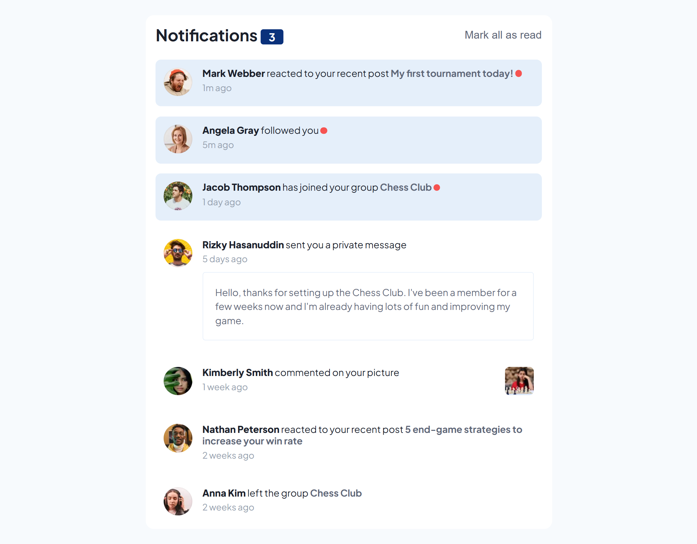
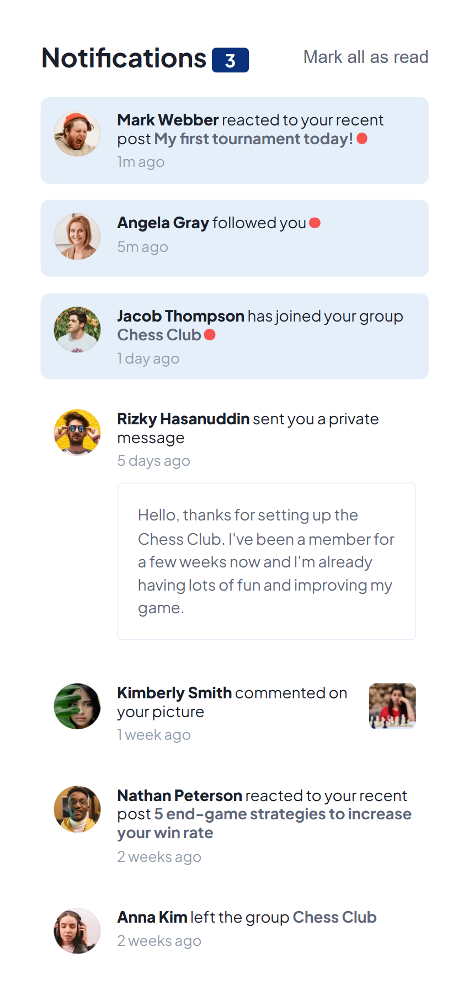
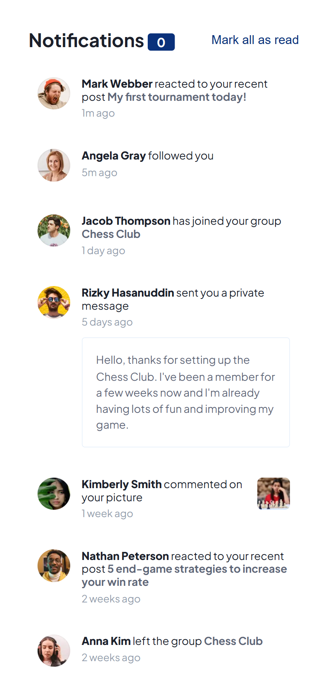

# Frontend Mentor - Notifications page solution

This is a solution to the [Notifications page challenge on Frontend Mentor](https://www.frontendmentor.io/challenges/notifications-page-DqK5QAmKbC). Frontend Mentor challenges help you improve your coding skills by building realistic projects. 

## Table of contents

- [Overview](#overview)
  - [The challenge](#the-challenge)
  - [Screenshot](#screenshot)
  - [Links](#links)
- [My process](#my-process)
  - [Built with](#built-with)
  - [What I learned](#what-i-learned)
  - [Continued development](#continued-development)
  - [Useful resources](#useful-resources)


**Note: Delete this note and update the table of contents based on what sections you keep.**

## Overview

### The challenge

Users should be able to:

- Distinguish between "unread" and "read" notifications
- Select "Mark all as read" to toggle the visual state of the unread notifications and set the number of unread messages to zero
- View the optimal layout for the interface depending on their device's screen size
- See hover and focus states for all interactive elements on the page

### Screenshot






### Links

- Solution URL: [Add solution URL here](https://your-solution-url.com)
- Live Site URL: [Add live site URL here](https://your-live-site-url.com)

## My process

### Built with

- Semantic HTML5 markup
- CSS custom properties
- Flexbox
- Mobile-first workflow
- Vanilla JavaScript
- OOP (Object Oriented Programming)
- Functional programming

### What I learned

In this project, I had the opportunity to flex my programming skills using the OOP paradigm, and functional programming all this tied together with the DOM manipulation. I learned to use methods to create components inside an Object instance, that can be reused in our case where different elements are needed. Additionally, lately I have been using modules to create more compact, and readable JavaScript code, which I have found to be extremely helpful when debugging.

To see how you can create an Object instance of a notification component, see below:


```js
class Follower {
  constructor (name, avatar, time, status, reaction, subject, chat, pictureUrl) {
    // My code here
  }

  // Creating different components functionality that meet the required conditions on the UI of the component

  createAvatarElement() {
    // code for creating avatar
  }

  createFollowerMessage() {
    // code to create the different message of the followers
  }

  createWrapper() {
    // code for creating wrapper depending on whether the notification component is unread or not.
  }

  createDetailsElement() {
    // code for creating details content depending on if there is an additional content to the notification or not.
  }

  createCard() {
    // code to create the wrapper of all the above components..
  }
}
```

### Continued development

In general, this project was a good exercise to cover again some concepts of the OOP paradigm. However, I think I still need to learn more about the DOM manipulation the more advanced technique that I can use. Additionally, I need a refresher on asynchronous programming, where I struggled a bit in this project. Over all, I need to do more projects to improve my code.


### Useful resources

- [Amazon Q Developer](https://aws.amazon.com/q/developer/) - I would advise to use this tool minimally, in my case I use it as a supervisor who I can ask any question in tandem with googling, you have a teacher with you..
- [Mozilla Developer (MDN)](https://developer.mozilla.org/en-US/) - I can't stress enough about the importance of MDN, this is a very helpful tool when you want to refresh on the syntax or the inner structure of an element, or objects.

